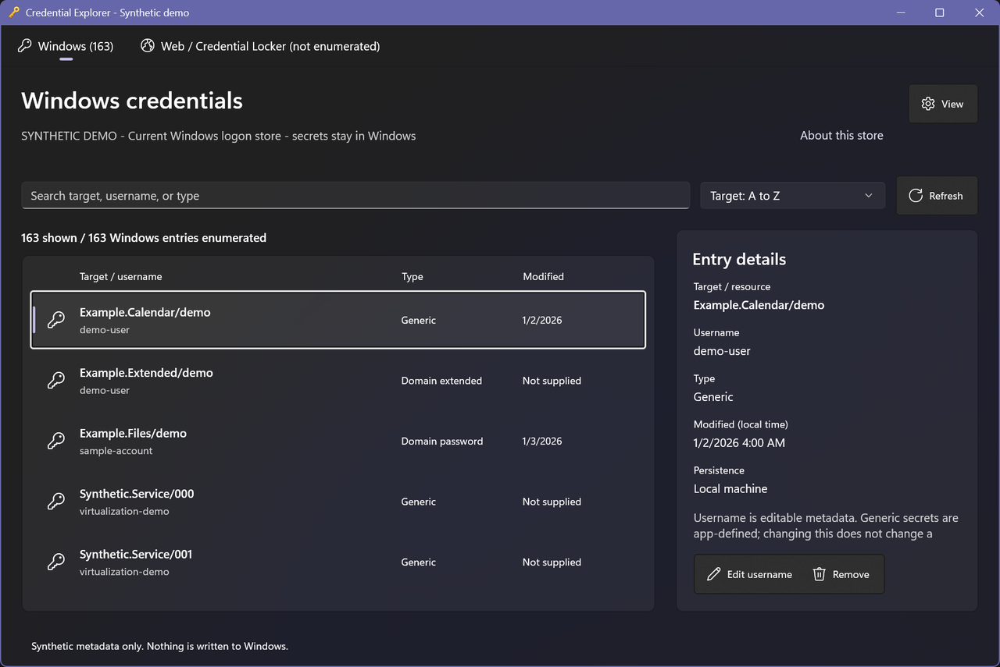
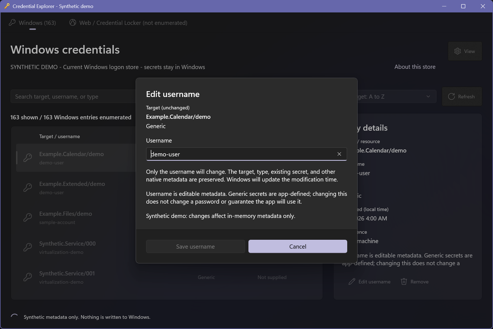

# Credential Explorer

A standalone WinUI 3 metadata-only front end over the current user's existing credential stores. There is no new password database, telemetry, network client, metadata persistence, or secret reveal, copy, replacement, or export. Supported Windows entries allow explicitly confirmed username-only metadata edits while retaining the existing secret.

## Screenshots

All entries, usernames, counts, and dates below come from the isolated synthetic demo, not a real credential store.



Username-only editing names the exact entry, preserves the existing secret, and defaults to Cancel.



## Features

- Separate Windows and Web / Credential Locker views with accurate per-store enumeration counts.
- Search target/resource, username, and type; sort by target, username, type, or modification time.
- Virtualized list and master-detail metadata view.
- Aligned icon/type/date rows, Comfortable/Compact density, Mica around native surfaces, and contextual actions.
- Native command bars and quiet scope/appearance flyouts instead of persistent instructional panels.
- Refresh, explicit error states, and single-entry removal with confirmation and Cancel as the default.
- Guarded username-only editing for Windows Generic and Domain password entries.
- System, Light, and Dark themes using native WinUI resources, including native high-contrast support.
- DPI-aware window sizing, responsive layout, accessible control names, and automation IDs.
- Isolated synthetic demo modes and a small assertion runner for safe verification.

The app currently has an English-language UI. GitHub Actions builds unsigned development artifacts; public installers require the signed release workflow described below.

The gold key icon is original emoji-style artwork, shared by the native system menu, executable, and packaged app logos. To regenerate the multi-resolution ICO and PNG assets, run `python .\scripts\generate-icons.py` with Pillow installed. Pillow is not required to build or run the app.

## Stores and limitations

**Windows** uses `CredEnumerateW(NULL, 0)` for the current logon credential set. Each native allocation is released once with `CredFree`, including when metadata projection fails. The interop structure contains opaque blob pointers to preserve the native layout, but the app never dereferences or marshals secret contents, attributes, or comments. Removal uses the exact enumerated target and type with `CredDeleteW(..., 0)`. Extended, obsolete, and unknown types remain visible but read-only rather than guessing their deletion identity.

**Web / Credential Locker** uses the supported WinRT `PasswordVault.RetrieveAll` API. A full-trust desktop app can access the user's Credential Lockers; this is not an AppContainer app. Only Resource and UserName are projected. `RetrievePassword`, `Retrieve`, and the Password property are never used. Modification time, persistence, and owning-app identity are not supplied by this API. Removal matches exactly one Resource/UserName pair in a fresh metadata snapshot and passes that object to `PasswordVault.Remove`.

This Web view is explicitly scoped to Credential Locker, not a claim to enumerate every historical Control Panel Web Credentials vault. Undocumented `vaultcli.dll` / `VaultEnumerateItems` entry points are not used. Browser-managed databases (Edge, Chrome, Firefox, etc.) are outside scope. Errors or unsupported access appear with preserved Win32 codes/HRESULTs and redacted diagnostics, not an empty-success fallback.

Counts are per successfully enumerated store, with a separate filtered count. They are not capacity measurements. There is no universal maximum or percent-full meter. A Win32 error 8 does not prove a fixed count or byte limit. Prefixes are not treated as app ownership. Snapshots can change externally; Refresh re-enumerates, and removal errors remain explicit.

### Username-only editing

Only Windows Generic (`CRED_TYPE_GENERIC`) and Domain password (`CRED_TYPE_DOMAIN_PASSWORD`) entries can be edited. The dialog names the exact target and type; only Username is writable. Save is disabled for unchanged or invalid input, and Cancel is the default. Generic usernames are app-defined metadata and may not be used by the owning app. Changing a domain username can affect automatic authentication even though the password is unchanged.

The service re-reads the exact target/type using `CredReadW`, rejects changes to the enumerated username, modification time, or persistence, and keeps that native allocation alive through the write. It preserves the fresh record's flags, target, type, comment, alias, attribute pointers, and persistence without projecting app-defined contents into managed values. It then calls `CredWriteW` with `CRED_PRESERVE_CREDENTIAL_BLOB`, a zero blob size, and a null blob pointer. Missing entries are not recreated. Native allocations and temporary username memory are released on both success and failure. Windows supplies the new modification time.

Windows has no compare-and-swap credential update API: the pre-write freshness check cannot lock out another app writing concurrently. Refresh after edits, and use the owning app's sign-in flow when in doubt. Web / Credential Locker, certificate, extended, obsolete, and unknown types do not allow username editing. Target renaming, type changes, secret replacement, and generic password editors are not implemented.

## Running locally

### Prerequisites

- Windows 10 version 1809 or newer; Windows 11 recommended.
- .NET 10 SDK.
- Visual Studio with WinUI development tools and the Windows SDK.
- [Windows App Development CLI (`winapp`)](https://github.com/microsoft/WinAppCli).
- Developer Mode already enabled for local development package registration.

Setup does not enable Developer Mode, install prerequisites, or invoke credential prompts. If using Copilot with the WinUI skills installed, `/winui-setup` can help configure missing prerequisites; invoke it yourself.

### Build and launch

From a PowerShell terminal:

```powershell
git clone https://github.com/shanselman/CredentialExplorer.git
Set-Location .\CredentialExplorer
dotnet build .\CredentialExplorer.csproj -p:Platform=x64
winapp run .\CredentialExplorer.csproj --no-build -p Platform=x64
```

On an ARM64 development machine, use `Platform=ARM64` and `RuntimeIdentifier=win-arm64` when building, and pass `-p Platform=ARM64 --arch arm64` to `winapp run`. No personal Copilot plugin paths are needed to build the project.

The normal app reads the host stores. Removal is one entry at a time, explicitly confirmed with the store, target/resource, username, type, and a warning about signing in again. Cancel is the default. There is no auto-cleanup or bulk removal. System theme is the default; Light/Dark overrides are session-only, and native high-contrast resources remain in use.

## Safe verification

```powershell
dotnet run --project .\Tests\CredentialExplorer.Tests.csproj
winapp run .\CredentialExplorer.csproj --no-build -p Platform=x64 --args "--demo"
```

`--demo` selects an isolated in-memory metadata service (163 Windows and 2 Credential Locker samples). `--demo-empty` and `--demo-failure` exercise explicit empty and failed-enumeration states. These modes never access any host credential API. The assertion runner checks native layout, secret-pointer non-access, preserved write flags/fields/buffer lifetimes using a fake native boundary, stale-entry rejection, queries, independent counts, edit/removal cancellation, confirmed in-memory username edits/removal, and errors. It does not write, read, edit, or delete real credentials. UI automation must cancel removal dialogs; it must never edit or remove a host entry without separate specific user permission.

For a running synthetic app, `.\scripts\ui-tests.ps1 -AppPid <PID> -ArtifactDirectory <scratch-folder>` checks search, selection, editing/validation/cancellation, context menus, density, counts, sorting, virtualization, Light/Dark themes, refresh, and accessible control names/IDs. Use `-Mode Empty` or `-Mode Failure` for the corresponding launch mode. The script refuses to inspect or capture a window unless its visible scope summary identifies synthetic mode. Keep screenshots and test results outside the source folder.

**UI automation caveat:** run pointer/context-menu checks on an isolated interactive Windows desktop. Background mouse delivery can be ignored by WinUI, and restoring another app's focus can dismiss a flyout before an assertion observes it. These checks remain explicit failures, not silently skipped passes. The app also supports the standard Shift+F10 keyboard context menu; edit/remove actions remain directly available in the detail command bar. High-contrast styling uses native resources but has not been visually exercised in an OS high-contrast session.

An opt-in `dotnet run --project .\Tests\CredentialExplorer.Tests.csproj -- --native-readonly` smoke check reads host metadata without printing any names, usernames, or counts. It performs no native writes, secret reads, or removals. This is separate from the default synthetic assertion run.

## Builds and releases

**Build and test** runs on pushes to `main`, pull requests, and manual dispatch. It executes synthetic assertions only, then cross-builds self-contained x64 and ARM64 MSIX packages on Windows runners. It does not launch the app, access host credential stores, install certificates, or change Developer Mode. Unsigned packages and SHA-256 checksums are retained as development artifacts, not published as installable releases.

Local packaging uses the same script as CI:

```powershell
.\scripts\Build-Package.ps1 -Architecture x64 -Version 0.1.0
.\scripts\Build-Package.ps1 -Architecture arm64 -Version 0.1.0
```

The app retains full-trust MSIX identity and includes both .NET and Windows App Runtime files. It is not an unpackaged portable EXE. Publish trimming and ReadyToRun are disabled for this initial release pipeline to avoid changing WinUI reflection/runtime behavior. Outputs are under `artifacts\packages`; no local signing or certificate trust is performed.

**Signed release** runs for stable `vMAJOR.MINOR.PATCH` tags or manual dispatch. Like WindowsEdgeLight, it uses Azure Trusted Signing (now called Artifact Signing), but signs the MSIX rather than shipping a portable EXE. It validates signing configuration before building, signs both packages with an RFC 3161 timestamp, verifies their signatures, and regenerates checksums after signing. Tag runs create a **draft** release for human review. Manual dispatch defaults to signed artifacts only; opt into a draft with `publish_release`.

Configure these repository or organization **secrets**:

| Secret | Purpose |
| --- | --- |
| `AZURE_TENANT_ID` | Signing application's tenant |
| `AZURE_CLIENT_ID` | Signing application's client ID |
| `AZURE_CLIENT_SECRET` | Signing application's credential |

Configure these repository **variables**:

| Variable | Purpose |
| --- | --- |
| `SIGNING_ENDPOINT` | Regional HTTPS endpoint, such as `https://wus2.codesigning.azure.net/` |
| `SIGNING_ACCOUNT_NAME` | Existing Azure signing account |
| `SIGNING_CERTIFICATE_PROFILE` | Certificate profile authorized for this application |
| `MSIX_PUBLISHER` | Exact certificate subject distinguished name, matching the MSIX manifest publisher |

The signing identity must have the service's Certificate Profile Signer role. Obtain `MSIX_PUBLISHER` from the signing certificate/profile; do not guess it or leave the template `CN=AppPublisher`. Secrets must be provisioned through GitHub settings, never checked in or printed. The pipeline does not create Azure identities, grant roles, or copy WindowsEdgeLight's secrets. Missing configuration or invalid signatures stops publication; there is no unsigned fallback release.

After configuration, run **Signed release** manually with version `0.1.0` to verify signed artifacts before tagging. A stable tag such as `v0.1.0` creates the versioned draft only after all checks pass. Windows installs a trusted signed MSIX through App Installer; no development certificate installation or warning bypass is part of distribution.

## Project layout

| Path | Purpose |
| --- | --- |
| `MainPage.xaml`, `MainWindow.xaml` | WinUI application views |
| `Dialogs` | Explicit username-edit confirmation and validation |
| `ViewModels` | UI state, filtering, commands, and confirmation orchestration |
| `Core` | Metadata models, Windows interop, query logic, and synthetic service |
| `Services` | Supported Credential Locker integration |
| `Tests` | Synthetic assertions and opt-in redacted read-only native checks |
| `scripts` | Synthetic-only UI automation |

Do not contribute real credential metadata, host screenshots, secrets, signing keys, or local test output. Demo and test data must remain synthetic. Changes that access secret values, silently turn enumeration failures into empty stores, infer app ownership as fact, or add automatic/bulk removal are outside the current scope.

## API references

- [CredEnumerateW](https://learn.microsoft.com/windows/win32/api/wincred/nf-wincred-credenumeratew)
- [CREDENTIALW](https://learn.microsoft.com/windows/win32/api/wincred/ns-wincred-credentialw)
- [CredDeleteW](https://learn.microsoft.com/windows/win32/api/wincred/nf-wincred-creddeletew)
- [CredReadW](https://learn.microsoft.com/windows/win32/api/wincred/nf-wincred-credreadw)
- [CredWriteW and secret preservation](https://learn.microsoft.com/windows/win32/api/wincred/nf-wincred-credwritew)
- [PasswordVault desktop scope](https://learn.microsoft.com/uwp/api/windows.security.credentials.passwordvault)
- [RetrieveAll](https://learn.microsoft.com/uwp/api/windows.security.credentials.passwordvault.retrieveall)
- [RetrievePassword](https://learn.microsoft.com/uwp/api/windows.security.credentials.passwordcredential.retrievepassword)
